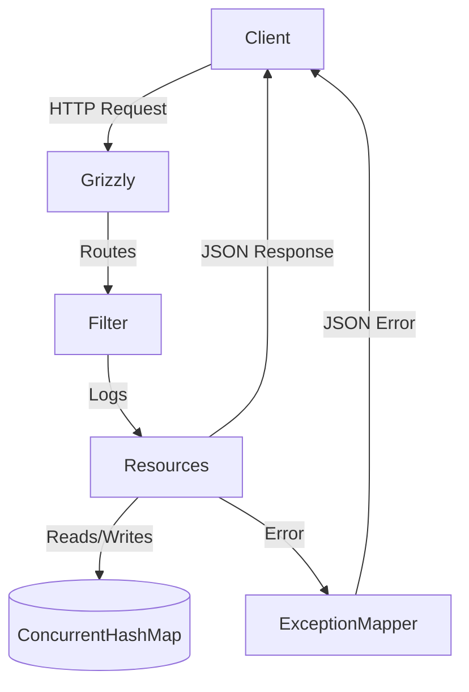
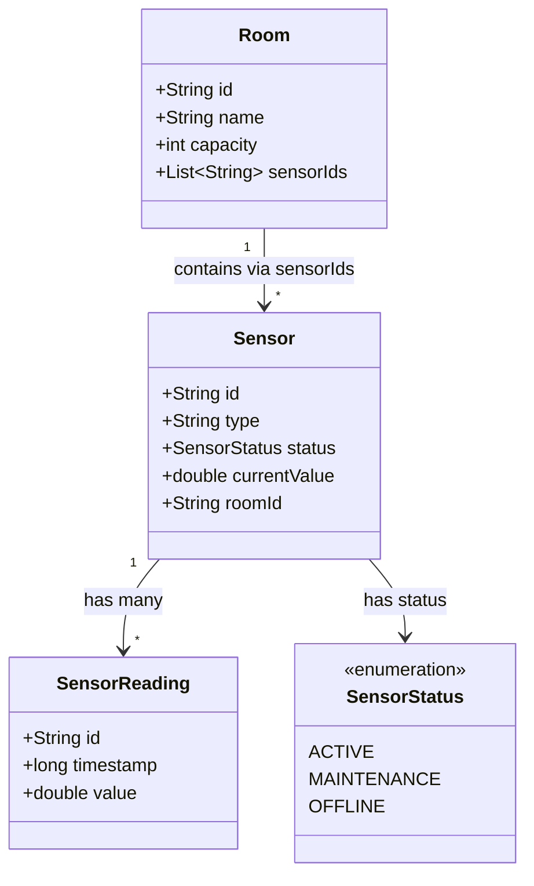

# Smart Campus Sensor & Room Management API

Production-style RESTful API coursework project built with JAX-RS (Jersey), Grizzly, Maven, and thread-safe in-memory storage.

## API Overview

- Base path: `/api/v1`
- Content type: JSON for requests and responses
- Storage: `ConcurrentHashMap` and `CopyOnWriteArrayList`
- Runtime: Jersey + Grizzly HTTP server
- Error handling: custom exception mappers + a global fallback mapper
- Observability: request and response logging via JAX-RS filters
## System Architecture


## Domain Model



### Main Resources

- `GET /api/v1`
- `GET /api/v1/rooms`
- `POST /api/v1/rooms`
- `GET /api/v1/rooms/{id}`
- `DELETE /api/v1/rooms/{id}`
- `GET /api/v1/sensors`
- `POST /api/v1/sensors`
- `GET /api/v1/sensors/{id}`
- `GET /api/v1/sensors/{sensorId}/readings`
- `GET /api/v1/sensors/{sensorId}/readings/{readingId}`
- `POST /api/v1/sensors/{sensorId}/readings`

## Project Structure

```text
smart-campus-sensor-room-management-api/
|-- pom.xml
|-- README.md
`-- src/
    `-- main/
        `-- java/
            `-- edu/
                `-- university/
                    `-- smartcampus/
                        |-- Main.java
                        |-- config/
                        |   `-- ApplicationConfig.java
                        |-- dto/
                        |   |-- ApiInfoResponse.java
                        |   |-- ErrorResponse.java
                        |   `-- request/
                        |       |-- CreateRoomRequest.java
                        |       |-- CreateSensorReadingRequest.java
                        |       `-- CreateSensorRequest.java
                        |-- exception/
                        |   |-- DuplicateResourceException.java
                        |   |-- InvalidPayloadException.java
                        |   |-- LinkedResourceNotFoundException.java
                        |   |-- ResourceNotFoundException.java
                        |   |-- RoomNotEmptyException.java
                        |   |-- SensorUnavailableException.java
                        |   `-- mapper/
                        |       |-- AbstractExceptionMapper.java
                        |       |-- DuplicateResourceExceptionMapper.java
                        |       |-- InvalidPayloadExceptionMapper.java
                        |       |-- LinkedResourceNotFoundExceptionMapper.java
                        |       |-- ResourceNotFoundExceptionMapper.java
                        |       |-- RoomNotEmptyExceptionMapper.java
                        |       |-- SensorUnavailableExceptionMapper.java
                        |       |-- ThrowableExceptionMapper.java
                        |       `-- WebApplicationExceptionMapper.java
                        |-- filter/
                        |   `-- RequestResponseLoggingFilter.java
                        |-- model/
                        |   |-- Room.java
                        |   |-- Sensor.java
                        |   |-- SensorReading.java
                        |   `-- SensorStatus.java
                        |-- resource/
                        |   |-- ApiRootResource.java
                        |   |-- RoomResource.java
                        |   |-- SensorReadingResource.java
                        |   `-- SensorResource.java
                        |-- service/
                        |   |-- RoomService.java
                        |   `-- SensorService.java
                        |-- store/
                        |   `-- InMemoryDataStore.java
                        `-- util/
                            `-- IdGenerator.java
```

## Setup Instructions

### Prerequisites

- Java 17 or newer
- Maven 3.9 or newer

### Run with Maven

```bash
mvn clean compile exec:java
```

The API will start on:

```text
http://localhost:8080/api/v1
```

### Package a Runnable JAR

```bash
mvn clean package
java -jar target/smart-campus-sensor-room-management-api-1.0.0.jar
```

## Example cURL Commands

### Discovery endpoint
curl  http://localhost:8080/api/v1/

### 1. Create Room

```bash
curl -X POST http://localhost:8080/api/v1/rooms \
  -H "Content-Type: application/json" \
  -d '{
    "id": "room-a101",
    "name": "Advanced Robotics Lab",
    "capacity": 40
  }'
```

### 2. Get Rooms

```bash
curl http://localhost:8080/api/v1/rooms
```

### 3. Create Sensor

```bash
curl -X POST http://localhost:8080/api/v1/sensors \
  -H "Content-Type: application/json" \
  -d '{
    "id": "sensor-co2-01",
    "type": "CO2",
    "status": "ACTIVE",
    "roomId": "room-a101"
  }'
```

### 4. Filter Sensors by Type

```bash
curl "http://localhost:8080/api/v1/sensors?type=CO2"
```

### 5. Add Sensor Reading

```bash
curl -X POST http://localhost:8080/api/v1/sensors/sensor-co2-01/readings \
  -H "Content-Type: application/json" \
  -d '{
    "id": "reading-001",
    "timestamp": 1710000000000,
    "value": 643.5
  }'
```

### 6. Get Sensor Readings

```bash
curl http://localhost:8080/api/v1/sensors/sensor-co2-01/readings
```

### 7. Delete Room

```bash
curl -X DELETE http://localhost:8080/api/v1/rooms/room-a101
```

## Example Responses

### API Root

```json
{
  "version": "v1",
  "contact": "admin@university.edu",
  "resources": {
    "rooms": "/api/v1/rooms",
    "sensors": "/api/v1/sensors"
  }
}
```

### Error Response

```json
{
  "error": "Room with id room-a101 still has linked sensors and cannot be deleted.",
  "status": 409
}
```
## API Endpoints Summary

| Category | Method | Endpoint | Description | Status Codes |
|----------|--------|----------|-------------|--------------|
| Rooms | GET | /api/v1/rooms | List all rooms | 200 OK |
| | POST | /api/v1/rooms | Create a new room | 201 Created, 400, 409 |
| | GET | /api/v1/rooms/{roomId} | Get a specific room | 200 OK, 404 |
| | DELETE | /api/v1/rooms/{roomId} | Delete a room | 204, 404, 409 |
| Sensors | GET | /api/v1/sensors | List all sensors | 200 OK |
| | POST | /api/v1/sensors | Create a new sensor | 201 Created, 400, 422 |
| | GET | /api/v1/sensors/{sensorId} | Get a specific sensor | 200 OK, 404 |
| | GET | /api/v1/sensors?type={t} | Filter sensors by type | 200 OK |
| Readings | GET | /api/v1/sensors/{sensorId}/readings | Get all readings | 200 OK, 404 |
| | POST | /api/v1/sensors/{sensorId}/readings | Add a reading | 201 Created, 403, 404 |

### Coursework Tasks

## Part 1: Service Architecture & Setup


## Q1.1 In your report, explain the default lifecycle of a JAX-RS Resource class. Is a new instance instantiated for every incoming request, or does the runtime treat it as a singleton?

   By default, JAX-RS creates a brand-new instance of the resource class for every single HTTP request. Because of this "per-request" lifecycle, we can't just save our data in normal instance variables, because they will get destroyed as soon as the request ends.

   To fix this and prevent data loss, I used a separate DataStore class that holds my data using ConcurrentHashMap collections. This keeps the data safely stored in the server's global memory. Using ConcurrentHashMap also ensures that if multiple clients try to add or read data at the exact same time, the system won't crash or create race conditions.


##Q2. Why is the provision of "Hypermedia" (links and navigation within responses) considered a hallmark of advanced RESTful design (HATEOAS)? How does this approach benefit client developers compared to static documentation?

   HATEOAS means the API includes navigation links directly inside its responses. In my project, the discovery endpoint (/api/v1) provides the direct links to the rooms and sensors collections.
   Instead of frontend developers having to hardcode URLs into their applications and read pages of static documentation, they can just follow the links provided by the API dynamically. This makes the API much easier to integrate. Also, if I ever need to change the server's URL structure in the future, the client applications won't break because they are just following the updated links automatically.


## Part 2: Room Management


 Q1. When returning a list of rooms, what are the implications of returning only IDs versus returning the full room objects? Consider network bandwidth and client side processing.
        
        If we only return an array of Room IDs, the response size is very small, which saves bandwidth. However, it creates a big problem for the client because they will have to make many extra API calls to get the actual details (like name and capacity) for each room.
By returning the full room objects, the initial response is slightly larger, but the client gets all the necessary information in just one single network request. For a system like a Smart Campus, this approach is much better because it reduces network delays and makes the frontend application much faster and easier to build.


## Q2. Is the DELETE operation idempotent in your implementation? Provide a detailed justification by describing what happens if a client mistakenly sends the exact same DELETE request for a room multiple times.
       
       Yes, my DELETE operation is perfectly idempotent. In REST, idempotency means that doing the exact same action multiple times leaves the server in the exact same state.
       If a client sends a DELETE request for a room, it gets deleted successfully and returns a 204 No Content. If they mistakenly send that exact same request again, the server simply returns a 404 Not Found because the room is already gone. Even though the status code is different the second time, the server's state hasn't changed (the room is still safely deleted), so it perfectly follows the idempotency rule.

## Part 3: Sensor Operations & Linking

## Q1. We explicitly use the @Consumes (MediaType.APPLICATION_JSON) annotation on the POST method. Explain the technical consequences if a client attempts to send data in a different format, such as text/plain or application/xml. How does JAX-RS handle this mismatch?
       
       If a client tries to send a format like text/plain or application/xml to an endpoint that strictly expects JSON, JAX-RS will automatically block the request before it even reaches my Java code.
       The framework will instantly return an HTTP 415 Unsupported Media Type error. This is a great built-in safety feature because it stops the server from trying to process incompatible data. If the server tried to read that bad data into my Sensor model, it would cause the application to crash or throw errors.

## Q2. You implemented this filtering using @QueryParam. Contrast this with an alternative design where the type is part of the URL path (e.g., /api/v1/sensors/type/CO2). Why is the query parameter approach generally considered superior for filtering and searching collections?
    
    URL paths should be used to point to a specific resource, while query parameters are meant for filtering those resources. If I used /sensors/type/CO2, it makes it look like type/CO2 is a permanent sub-folder in the API, which is confusing.
    Using ?type=CO2 clearly shows that we are looking at the main sensors collection, but just applying a filter to narrow down the results. Query parameters are also much better because they are optional, and it's very easy to combine multiple filters later (like ?type=CO2&status=ACTIVE) without making the URL path overly complicated.

## 4: Deep Nesting with Sub-Resources
## Q1. Discuss the architectural benefits of the Sub-Resource Locator pattern. How does delegating logic to separate classes help manage complexity in large APIs compared to defining every nested path (e.g., sensors/{id}/readings/{rid}) in one massive controller class?
    
    The Sub-Resource Locator pattern helps keep the code clean and modular. If I put all the logic for sensor readings inside the main SensorResource class, that file would quickly become massive and very hard to manage.
    By delegating the /readings path to a completely separate SensorReadingResource class, each class focuses on just one specific job (Single Responsibility Principle). SensorResource handles the sensors, and SensorReadingResource handles the reading history. This makes the code much easier to read, test, and scale up in the future.

## Part 5: Error Handling, Exception Mapping & Logging

## Q1. Why is HTTP 422 often considered more semantically accurate than a standard 404 when the issue is a missing reference inside a valid JSON payload?
     
     A 404 Not Found error tells the client that the URL they typed doesn't exist. But when a client makes a POST request to /api/v1/sensors, the URL is completely fine.
     The issue is that the roomId inside their JSON body is fake. Returning an HTTP 422 Unprocessable Entity is much more accurate because it tells the client: "Your URL is correct, and your JSON format is readable, but the actual data values you sent are logically invalid and break our business rules."

## Q2. From a cybersecurity standpoint, explain the risks associated with exposing internal Java stack traces to external API consumers. What specific information could an attacker gather from such a trace?
      
      Exposing raw stack traces is very dangerous because it shows attackers exactly how the server is built under the hood. It reveals our internal package names, file pathways, and the exact versions of the libraries (like Jersey) we are using.
      Attackers can take this version information and look up known security vulnerabilities to hack the server. To protect the API, my GlobalExceptionMapper hides all these technical details by catching the errors and just returning a safe, generic 500 Internal Server Error message to the user.

## Q3. Why is it advantageous to use JAX-RS filters for cross-cutting concerns like logging, rather than manually inserting Logger.info() statements inside every single resource method?
     If I manually typed Logger.info() inside every single API method, I would be writing a lot of repetitive code. Also, if I added a new endpoint later, I might easily forget to include the logging statements.
     By using a JAX-RS filter (like my LoggingFilter), the logging logic is handled in one central place. The filter sits in the background and automatically intercepts and logs every incoming request and outgoing response. This keeps my actual resource methods perfectly clean and focused only on the main business logic.


## Notes


