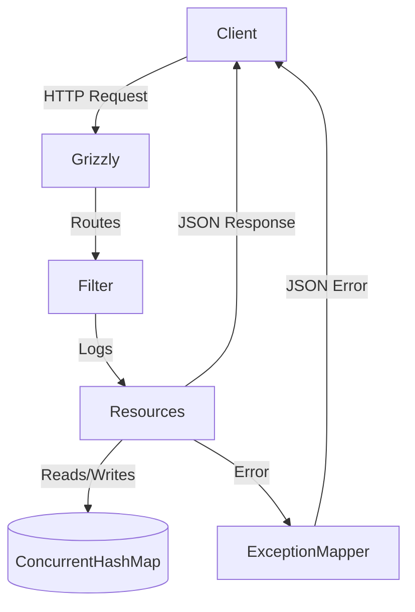
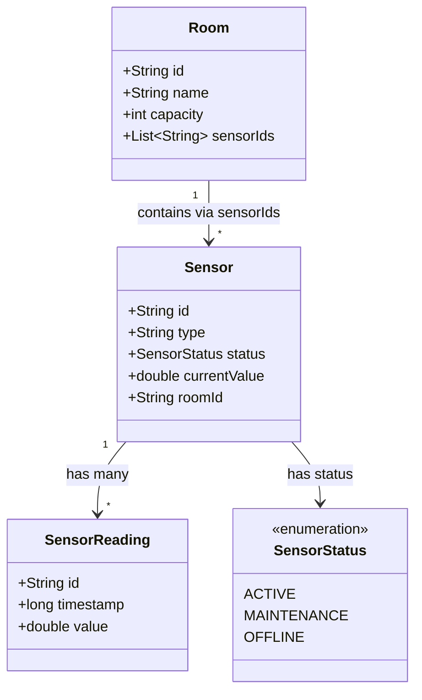

# Smart Campus Sensor & Room Management API

Production-style RESTful API coursework project built with JAX-RS (Jersey), Grizzly, Maven, and thread-safe in-memory storage.

## API Overview

- Base path: `/api/v1`
- Content type: JSON for requests and responses
- Storage: `ConcurrentHashMap` and `CopyOnWriteArrayList`
- Runtime: Jersey + Grizzly HTTP server
- Error handling: custom exception mappers + a global fallback mapper
- Observability: request and response logging via JAX-RS filters
## System Architecture


## Domain Model



### Main Resources

- `GET /api/v1`
- `GET /api/v1/rooms`
- `POST /api/v1/rooms`
- `GET /api/v1/rooms/{id}`
- `DELETE /api/v1/rooms/{id}`
- `GET /api/v1/sensors`
- `POST /api/v1/sensors`
- `GET /api/v1/sensors/{id}`
- `GET /api/v1/sensors/{sensorId}/readings`
- `GET /api/v1/sensors/{sensorId}/readings/{readingId}`
- `POST /api/v1/sensors/{sensorId}/readings`

## Project Structure

```text
smart-campus-sensor-room-management-api/
|-- pom.xml
|-- README.md
`-- src/
    `-- main/
        `-- java/
            `-- edu/
                `-- university/
                    `-- smartcampus/
                        |-- Main.java
                        |-- config/
                        |   `-- ApplicationConfig.java
                        |-- dto/
                        |   |-- ApiInfoResponse.java
                        |   |-- ErrorResponse.java
                        |   `-- request/
                        |       |-- CreateRoomRequest.java
                        |       |-- CreateSensorReadingRequest.java
                        |       `-- CreateSensorRequest.java
                        |-- exception/
                        |   |-- DuplicateResourceException.java
                        |   |-- InvalidPayloadException.java
                        |   |-- LinkedResourceNotFoundException.java
                        |   |-- ResourceNotFoundException.java
                        |   |-- RoomNotEmptyException.java
                        |   |-- SensorUnavailableException.java
                        |   `-- mapper/
                        |       |-- AbstractExceptionMapper.java
                        |       |-- DuplicateResourceExceptionMapper.java
                        |       |-- InvalidPayloadExceptionMapper.java
                        |       |-- LinkedResourceNotFoundExceptionMapper.java
                        |       |-- ResourceNotFoundExceptionMapper.java
                        |       |-- RoomNotEmptyExceptionMapper.java
                        |       |-- SensorUnavailableExceptionMapper.java
                        |       |-- ThrowableExceptionMapper.java
                        |       `-- WebApplicationExceptionMapper.java
                        |-- filter/
                        |   `-- RequestResponseLoggingFilter.java
                        |-- model/
                        |   |-- Room.java
                        |   |-- Sensor.java
                        |   |-- SensorReading.java
                        |   `-- SensorStatus.java
                        |-- resource/
                        |   |-- ApiRootResource.java
                        |   |-- RoomResource.java
                        |   |-- SensorReadingResource.java
                        |   `-- SensorResource.java
                        |-- service/
                        |   |-- RoomService.java
                        |   `-- SensorService.java
                        |-- store/
                        |   `-- InMemoryDataStore.java
                        `-- util/
                            `-- IdGenerator.java
```

## Setup Instructions

### Prerequisites

- Java 17 or newer
- Maven 3.9 or newer

### Run with Maven

```bash
mvn clean compile exec:java
```

The API will start on:

```text
http://localhost:8080/api/v1
```

### Package a Runnable JAR

```bash
mvn clean package
java -jar target/smart-campus-sensor-room-management-api-1.0.0.jar
```

## Example cURL Commands

### Discovery endpoint
curl  http://localhost:8080/api/v1/

### 1. Create Room

```bash
curl -X POST http://localhost:8080/api/v1/rooms \
  -H "Content-Type: application/json" \
  -d '{
    "id": "room-a101",
    "name": "Advanced Robotics Lab",
    "capacity": 40
  }'
```

### 2. Get Rooms

```bash
curl http://localhost:8080/api/v1/rooms
```

### 3. Create Sensor

```bash
curl -X POST http://localhost:8080/api/v1/sensors \
  -H "Content-Type: application/json" \
  -d '{
    "id": "sensor-co2-01",
    "type": "CO2",
    "status": "ACTIVE",
    "roomId": "room-a101"
  }'
```

### 4. Filter Sensors by Type

```bash
curl "http://localhost:8080/api/v1/sensors?type=CO2"
```

### 5. Add Sensor Reading

```bash
curl -X POST http://localhost:8080/api/v1/sensors/sensor-co2-01/readings \
  -H "Content-Type: application/json" \
  -d '{
    "id": "reading-001",
    "timestamp": 1710000000000,
    "value": 643.5
  }'
```

### 6. Get Sensor Readings

```bash
curl http://localhost:8080/api/v1/sensors/sensor-co2-01/readings
```

### 7. Delete Room

```bash
curl -X DELETE http://localhost:8080/api/v1/rooms/room-a101
```

## Example Responses

### API Root

```json
{
  "version": "v1",
  "contact": "admin@university.edu",
  "resources": {
    "rooms": "/api/v1/rooms",
    "sensors": "/api/v1/sensors"
  }
}
```

### Error Response

```json
{
  "error": "Room with id room-a101 still has linked sensors and cannot be deleted.",
  "status": 409
}
```
## API Endpoints Summary

| Category | Method | Endpoint | Description | Status Codes |
|----------|--------|----------|-------------|--------------|
| Rooms | GET | /api/v1/rooms | List all rooms | 200 OK |
| | POST | /api/v1/rooms | Create a new room | 201 Created, 400, 409 |
| | GET | /api/v1/rooms/{roomId} | Get a specific room | 200 OK, 404 |
| | DELETE | /api/v1/rooms/{roomId} | Delete a room | 204, 404, 409 |
| Sensors | GET | /api/v1/sensors | List all sensors | 200 OK |
| | POST | /api/v1/sensors | Create a new sensor | 201 Created, 400, 422 |
| | GET | /api/v1/sensors/{sensorId} | Get a specific sensor | 200 OK, 404 |
| | GET | /api/v1/sensors?type={t} | Filter sensors by type | 200 OK |
| Readings | GET | /api/v1/sensors/{sensorId}/readings | Get all readings | 200 OK, 404 |
| | POST | /api/v1/sensors/{sensorId}/readings | Add a reading | 201 Created, 403, 404 |

## Coursework Theory Answers

### 1. JAX-RS Lifecycle: Per-request vs Singleton

By default, root resource classes are created per request, which keeps them stateless and safe for concurrent traffic. Singleton resources live for the whole application lifetime, reduce object creation, and can hold shared state, but they must be coded carefully because every request hits the same instance. In this project, resources are effectively stateless and the shared mutable data lives in a dedicated thread-safe store and service layer.

### 2. HATEOAS

HATEOAS means a server helps clients navigate the API by returning links or link-like controls in representations. A client can discover the next valid actions from the response instead of hardcoding every URI. This project keeps the root document discoverable by exposing the main collection endpoints, which is a lightweight step toward HATEOAS.

### 3. IDs vs Full Objects Tradeoff

Using IDs keeps payloads smaller, avoids duplication, and prevents nested object graphs from becoming inconsistent across requests. Returning full linked objects can reduce extra client calls, but it makes updates and ownership rules more complicated. This coursework uses IDs for relationships because the room-sensor association is simple and clear.

### 4. DELETE Idempotency

DELETE is idempotent because repeating the same request should leave the system in the same final state. If a room is deleted once, sending the same DELETE again should not create new side effects. The first call may return `204`, while a later call may return `404`, but the resource still remains deleted.

### 5. What Happens When `@Consumes` Does Not Match

If a client sends a request body with a `Content-Type` the endpoint does not accept, JAX-RS returns `415 Unsupported Media Type`. In this project, the `WebApplicationExceptionMapper` turns framework-generated errors like `415` into the same JSON error shape used by the rest of the API.

### 6. QueryParam vs PathParam for Filtering

`@PathParam` identifies a specific resource inside the URI hierarchy, such as `/rooms/{id}` or `/sensors/{sensorId}`. `@QueryParam` is better for optional filters on a collection, such as `/sensors?type=CO2`, because the resource is still the sensor collection and the query only narrows the result set.

### 7. Benefits of Sub-resources

Sub-resources keep nested relationships explicit and readable. `/sensors/{sensorId}/readings` makes it obvious that readings belong to one sensor and allows the parent sensor context to be resolved once and reused inside the child resource. This improves URI design and keeps reading-specific logic separate from general sensor operations.

### 8. HTTP 422 vs 404

Use `404 Not Found` when the URI points to a resource that does not exist, such as `GET /rooms/unknown-room`. Use `422 Unprocessable Entity` when the request body is structurally valid JSON but contains semantically invalid data, such as creating a sensor whose `roomId` does not exist. That distinction is why sensor creation uses `422` for missing linked rooms.

### 9. Stack Trace Security Risks

Sending stack traces to clients exposes internal package names, class names, file paths, library versions, and implementation details that attackers can use for reconnaissance. This project logs unexpected failures on the server side but returns a generic `500` message to clients.

### 10. Filters vs Manual Logging

Filters are better for cross-cutting concerns because they apply consistently to every request and response without duplicating code inside each resource method. Manual logging inside resources is harder to maintain, easier to forget, and mixes observability concerns with business logic.

## Notes

- The project uses thread-safe collections and a shared mutation lock to keep the room-sensor-reading relationships consistent.
- Room deletion enforces the coursework rule that rooms with linked sensors cannot be removed.
- Posting a reading updates the parent sensor's `currentValue`.
- Posting a reading while a sensor is in `MAINTENANCE` returns `403 Forbidden`.

